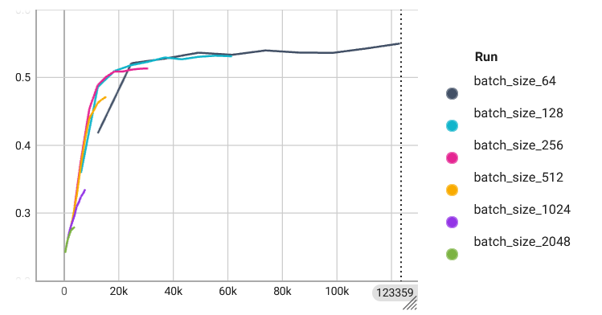
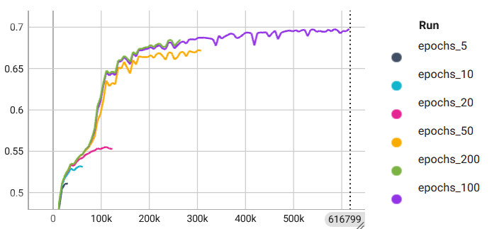
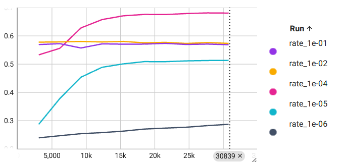

# Advanced Deep Learning Systems: Lab 1

**Basheq Tarifi**

  

## Overview
This lab involved an initial investigation into the use of MASE and Machop, including the different basic actions such as `train` and `test` as well as the effects of changing parameters used in training. Additionally, network structures (specifically those for the Jet Substructure dataset (JSC)) were looked at.

## Effects of Parameters
The effects of changing the batch size, epochs, and learning rate when training the `jsc-tiny` model was investigated. In order to train the models with multiple parameters, a `bash` script was written as follows:
```bash
#!/usr/bin/env bash
batch_sizes=(64 128 256 512 1024 2048)
for batch_size in "${batch_sizes[@]}"
do
    echo "Training with batch size: $batch_size"
    $MASE/machop/ch train jsc-tiny jsc --max-epochs 10 --batch-size $batch_size --project "lab-1_jsc-tiny_varying-batch-size"
done
echo "Training complete for all batch sizes."
```

This script trains the `jsc-tiny` model on the `jsc` dataset for the specified batch sizes. Similarly, other scripts were written to train the model while varying the number of epochs and the learning rate.

### Batch Size
> What is the impact of varying batch sizes and why?

The batch refers to the number of samples used in one iteration of training. Figure 1 shows the validation accuracy for different batch sizes with other parameters unchanged.

<figure>
  
  <figcaption><i>Figure 1: Validation accuracy for different batch sizes</i></figcaption>
</figure>

It is observed that increasing the batch size reduces model performance. While having a larger batch size means that each training iteration has a larger set of data to generalise on, it also means that less iterations can be done (since each epoch will be divided into a smaller number of batches). Having a smaller batch size also provides a noisier estimate of the gradient which will allow the optimisation function to get out of local minima and find a lower overall minima.

### Epochs
> What is the impact of varying maximum epoch number?

An epoch refers to one complete pass through the dataset. Increasing the number of epochs leads to better generalisation, as too few epochs result in underfitting of the data. This is seen in Figure 2.
<figure>
  
  <figcaption><i>Figure 2: Validation accuracy for different maximum epochs</i></figcaption>
</figure>

Increasing the number of epochs also results in slower training. Figure 2 shows that while the best performing model was trained with 100 epochs, 50 epochs produced a similar result and finished in half the time, which may be an acceptable trade-off. The model trained for 200 epochs stopped early due to the default timeout, but it can be seen it followed a similar trend to 200 epochs and would not have improved it much. Therefore, there is a maximal reasonable number of epochs to use where increasing it would lead to overfitting. This can be prevented by early-stopping.

### Learning rate
> What is happening with a large learning and what is happening with a small learning rate and why? What is the relationship between learning rates and batch sizes?

The learning rate refers to the rate at which gradients are updated during backpropagation in gradient descent. The results of training with different rates from $10^{-6}$ to $10^{-1}$ are shown in Figure 3.

<figure>
  
  <figcaption><i>Figure 3: Validation accuracy for different learning rates</i></figcaption>
</figure>

The learning rate of $10^{-4}$ outperforms the others by far. With the larger learning rates, the training can be unstable and oscillate, leading to missing minima. In contrast, the smaller rates do not converge fast enough to ever find the minima. The learning rate should be tuned to avoid these issues, and other methods can be used such as an adaptive learning rate based on the gradient values or a learning rate schedule which starts off high and progressively gets smaller.

The learning rate can be related to the batch size through the gradient calculation. With a larger batch size, the gradient calculation is a smoother estimate and a larger learning rate can be used. However, a smaller batch size will have a noisy estimate and a large learning rate my result in instability.

### Conclusion
These three parameters (among others) should be tuned to provide the best learning, but no single parameter will determine how well a model performs.

## Network Implementation
The `jsc-tiny` network has 117 parameters. A larger network, called `jsc-custom`, was designed with roughly 1.3k parameters as follows ([repo link](../../../machop/chop/models/physical/jet_substructure/__init__.py#L93) | [remote link](https://github.com/btarifi10/mase/tree/btarifi/dev/machop/chop/models/physical/jet_substructure/__init__.py#L93)):
```python
class JSC_Custom(nn.Module):
    def __init__(self, info):
        super(JSC_Custom, self).__init__()
        in_features = info.num_features
        num_classes = info.num_classes
        self.seq_blocks = nn.Sequential(
            # 1st LogicNets Layer
            nn.BatchNorm1d(in_features),  # input_quant       # 0
            nn.ReLU(in_features),                             # 1
            nn.Linear(in_features, 32),  # linear             # 2
            nn.BatchNorm1d(32),  # output_quant      # 3
            nn.ReLU(32),                             # 4
            nn.Dropout(0.2),                         # 5
            nn.Linear(32, 16),  # linear             # 2
            nn.BatchNorm1d(16),  # output_quant      # 7
            nn.ReLU(16),                             # 8
            nn.Dropout(0.2),                         # 5
            nn.Linear(16, num_classes),  # linear              # 10
            nn.BatchNorm1d(num_classes),  # output_quant       # 11
            nn.ReLU(num_classes),                              # 12
        )

    def forward(self, x):
        return self.seq_blocks(x)
```

This network was trained as follows:
```
$ che train jsc-custom jsc --max-epochs 20 --batch-size 128 --learning-rate 0.0001
```

The trained network had a final validation accuracy of 0.7202 and a test accuracy of 0.7194, indicating that it generalises well and is not overfitting the data. For higher results, the number of epochs could be increased.