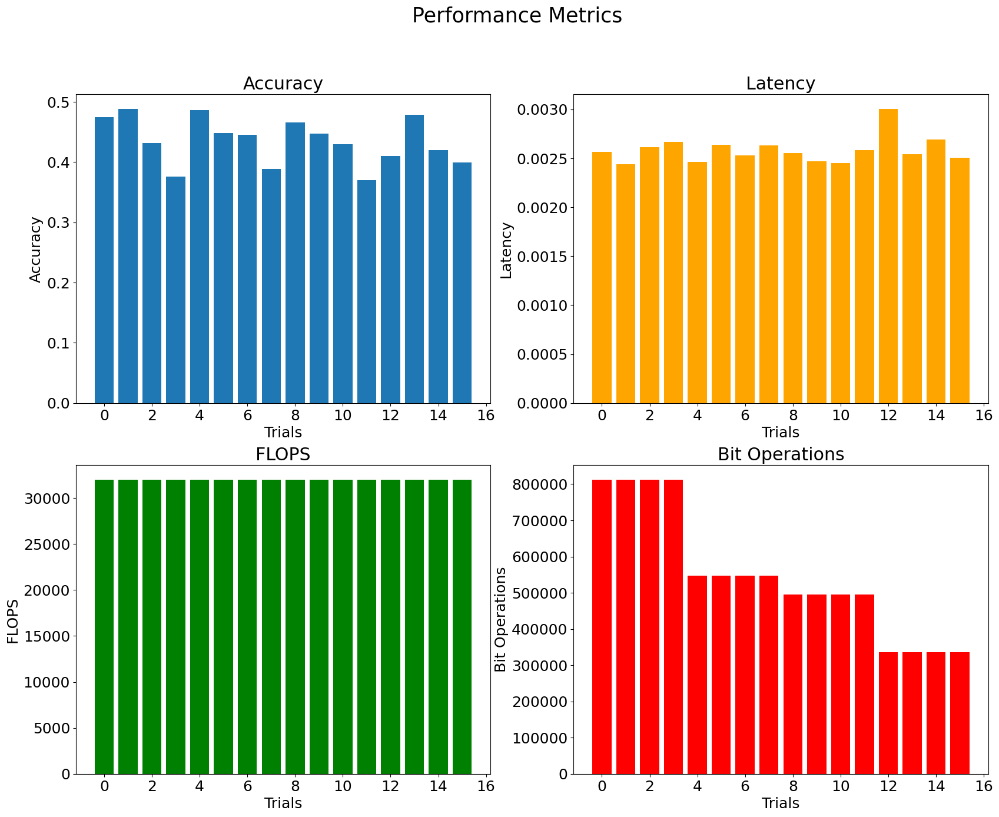
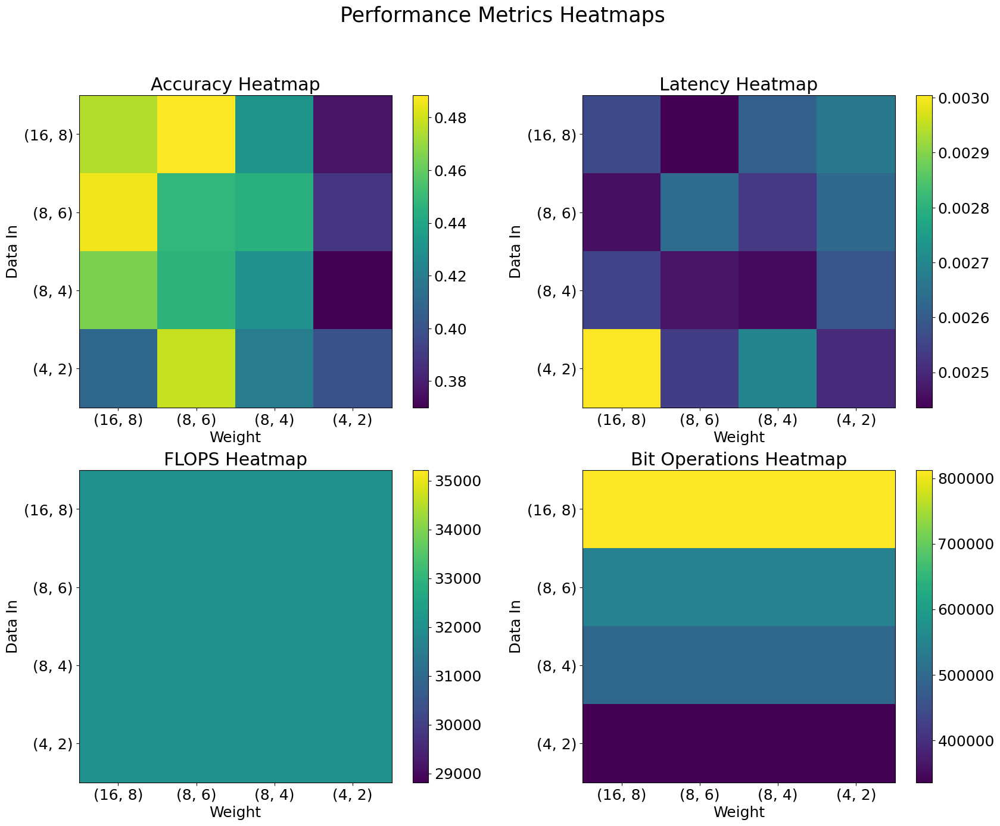
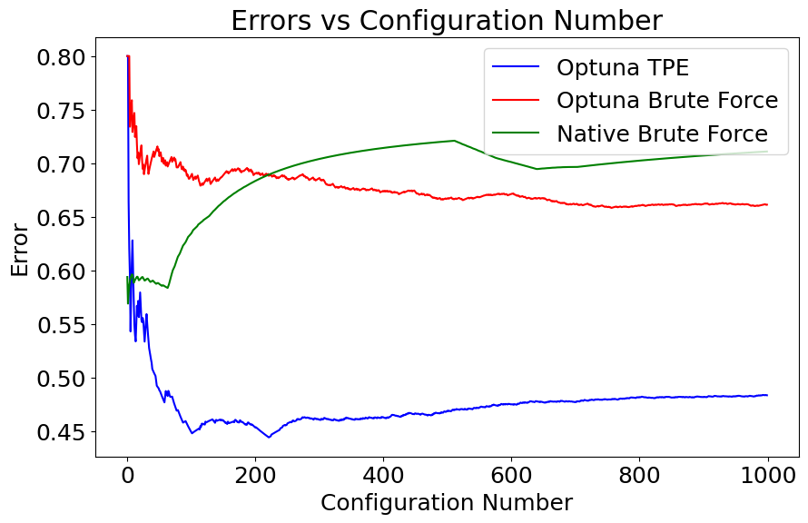
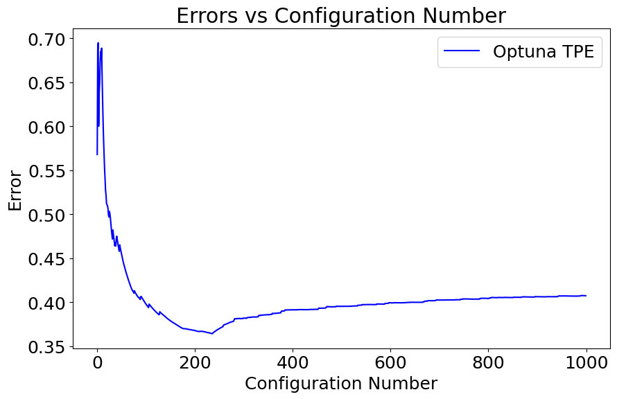

# Advanced Deep Learning Systems: Lab 3

**Basheq Tarifi**

  

## Overview
This lab involves an investigation into the search functionality in MASE. This functionality allows for powerful searches over a space of configurations or architectures which will allow you to find the best performing network automatically rather than manually training each network and comparing the results.

## A basic quantization search
In the Lab 3 Colab notebook, a search space was built using a set number of options for quantization of different layers. This is simply all of the possible configurations or "`pass_args`" which we would pass to the quantizer.

Once the search space is defined, each the model was quantised according to each configuration and then evaluated in terms of its performance.

```python
search_space = [ ... ] # list of configurations

for config in search_space:
    mg = quantize_pass(mg, config)

    accuracy = evaluate_accuracy(mg)
    other_metric = evaluate_other_metric(mg)
```

The best configuration can then be determined based on the different evaluated metrics. This flow was done as in the Lab 3 Colab notebook, and a number of metrics were considered:
- Accuracy: This is a measure on how well the model did in evaluating inputs. For the purposes of this task, it is a similar quality metric to loss as they are both evaluating the quality of "correctness"
- Latencies: This metric is to determine if different quantisations speed up the inference
- Total FLOPs: This is being used since it was implemented in Lab 2. However, it is expected that this number should remain the same as every layer's structure is the same.
- Total BitOPs: This metric can be used to determine how much the quantisation has reduced the number of BitOPs.

The search spaces available are shown in the following table, which is an exhuastive search between every possible pairing of the data in pair and the weight pair:
| Trial | Data In | Weight    |
| ---   | ---     | ---       |
| 0     | (16, 8) | (16, 8)   | 
| 1     | (16, 8) | (8, 6)    | 
| 2     | (16, 8) | (8, 4)    | 
| 3     | (16, 8) | (4, 2)    | 
| 4     | (8, 6)  | (16, 8)   | 
| 5     | (8, 6)  | (8, 6)    | 
| 6     | (8, 6)  | (8, 4)    | 
| 7     | (8, 6)  | (4, 2)    | 
| 8     | (8, 4)  | (16, 8)   | 
| 9     | (8, 4)  | (8, 6)    | 
| 10    | (8, 4)  | (8, 4)    | 
| 11    | (8, 4)  | (4, 2)    | 
| 12    | (4, 2)  | (16, 8)   |
| 13    | (4, 2)  | (8, 6)    | 
| 14    | (4, 2)  | (8, 4)    | 
| 15    | (4, 2)  | (4, 2)    | 

The results are shown in Figure 1 below.
<figure>
  
  <figcaption><i>Figure 1: Perfromance metrics for different quantisation configurations</i></figcaption>
</figure>
<br/>
These results, however, are difficult to interpret. We can plot them in a different way, as shown in Figure 2:
<figure>
  
  <figcaption><i>Figure 2: Perfromance heatmaps for different quantisation configurations</i></figcaption>
</figure>
<br/>
This is much more interpretable. For example, we can see that for the accuracy, the weight precision plays a bigger role than the input data precision; as such we may be able to quantize the input data and maintain a higher weight precision. From these results, and looking at the BitOPs and latency, we may decide that the configuration of quantizing the data to 8 bits and 4 fractional bits, i.e. `(8, 4)` while keeping the weight at `(16, 8)` is a good trade off between Accuracy and BitOPs.

Note that the best accuracy here is less than 50% which is not performant. This is likely because the evaluation was done on the inference directly after quantisation, so training the model again before evaluation would improve this. This is known as Quantisation Aware Training. As a further recommendation, the model size is a metric which may provide value in making these decisions.

## Adding a new search strategy
The above search strategy was very manual and coupled the search space with the strategy. MASE provides a decoupling of these two components such that the search space, which defines the total space of possible configurations and can alter the model as necessary, can be configured _independently_ of the search strategy. The strategy then evaluates the models based on the search space which provides the configurations and rebuilds the model for each trial. The evaluation is done using specified metrics. This leads to a very extendible and decoupled search which can be used to find the best model.

### Brute Force Strategy
A brute force search strategy was implemented as a new strategy in MASE which can be called by specifying the strategy as `brute_force` in the configuration or input parameters.

This brute force strategy, `SearchStrategyBruteForce`, inherits and implements the `SearchStrategy` and can be found in [brute_force.py](../../../machop/chop/actions/search/strategies/brute_force/brute_force.py) ([remote link](https://github.com/btarifi10/mase/tree/btarifi/dev/machop/chop/actions/search/strategies/brute_force/brute_force.py)):
```python
class SearchStrategyBruteForce(SearchStrategyBase):
    # Implementation
```

This strategy is compatible with existing search spaces, such as the `GraphSearchSpaceMixedPrecisionPTQ` search space. It uses the search space to obtain all possible configurations, which is done via choosing an index for each possible parameter. Instead of using for-loops to find configruations, the strategy takes the combinatorial product of all the options to form a grid of indices to query the search space with.

The strategy also uses the existing hardware and software runners for evaluation.

The strategy simply needs to be specified in the `toml` configuration (or via the command line):
```toml
[search.strategy]
name = "brute_force"
eval_mode = true
```

### Optuna
The existing strategy in MASE is the Optuna strategy, which provides a wrapper for _Optuna_, a framework for hyperparameter optimisation and tuning by searching the space of configurations and using an optimising function to find the best performing configurations.

Optuna provides a number of samplers, which can be used instead of the brute force approach. This is because brute force is too computationally expensive as the search space grows (since it grows combinatorially). An example of such a sampler is Tree-structured Parzen Estimator (TPE), which is designed to efficiently search the search space. It does this by iteratively modelling a probability distribution for which configurations lead to higher values and which of them lead to lower values (using the results of each sample), which is then used to provide samples of configurations likely to produce higher results.

#### Optuna Brute Force
It is also possible to get brute force out of the box with the `Optuna` search strategy, either by omitting the sampler or by explicitly adding the Optuna brute force sampler:
```python
def sampler_map(self, name):
    match name.lower():
        case "random":
            sampler = optuna.samplers.RandomSampler()
        case "tpe":
            sampler = optuna.samplers.TPESampler()
        # ... other samplers ...
        case "bruteforce":
            sampler = optuna.samplers.BruteForceSampler() # This is added
        case _:
            raise ValueError(f"Unknown sampler name: {name}")
    return sampler
```

### Comparison
The native brute force implementation was tested against Optuna's TPE and Optuna's brute force sampling searches and the results are shown in Figure 3.

<figure>
  
  <figcaption><i>Figure 3: Comparison between native brute force and Optuna methods</i></figcaption>
</figure>
<br/>

We can see that Optuna's error initally rises while it is modelling distributions but rapidly decreases soon after. It is able to find a better performing configuration much faster than brute force methods, as the search space is too large for brute force methods to do so efficiently. While 0.45 error would not be considered small, it is likely because no training is done on the networks after the quantisation.

### Adding a FLOPs and BitOPs runner
In order to evaluate the search space with metrics like those discussed above, a runner needs to be implemented. Based on the pass to count FLOPs and BitOPs which was implemented in Lab 2, a new runner called `basic_computation` was implemented. This can compute the total number of FLOPs (`total_flops`) or BitOPs (`total_bitops`) and use it in the evaluation. It is implemented by performing the analysis pass and then determining the total FLOPs and BitOPs.

In a problem where we are trying to evaluate models based on multiple objectives, for example in the above examples, it may be useful to have one unified metric. However, sometimes one metric such as `accuracy` needs to be maximised and another such as `total_bitops` needs to be minimised. To combat this we can maximise the negative of the `total_bitops` and then we will be maximising both metrics. An example unified metric can be expressed as follows:
```
unified_metric = 1*accuracy + (-0.0000000005)*total_bitops
```

In this metric we are negating the total bitops and also scaling it since it is in the order of $10^9$ and accuracy is between 0 and 1. The final metric will be the accuracy decreased by some number. In order to maximise the overall metric, both the accuracy and the scaled metric would need to be maximised (which would in turn minimise BitOPs).

This unified metric can be achieved in the configuration as follows:
```toml
[search.strategy.setup]
# ... other standard setup
sum_scaled_metrics = true # multi objective
direction = "maximize"

[search.strategy.metrics]
accuracy.scale = 1.0
accuracy.direction = "maximize"
total_bitops.scale = -0.0000000005
total_bitops.direction = "maximize"
```

Running this search with the Optuna TPE sampler produces the following result: 

|    |   number | software_metrics | hardware_metrics   | scaled_metrics |
| --- | --- | --- | --- | --- |
|  0 |      236 | {'loss': 1.029, 'accuracy': 0.635, 'total_flops': 1024512.0, 'total_bitops': 661733376.0} | {}                 | {'accuracy': 0.635, 'total_bitops': -0.331} |

Figure 4 below shows the search errors and we can see that indeed, trial 236 is the minimum error for the TPE search.

<figure>
  
  <figcaption><i>Figure 3: Comparison between native brute force and Optuna methods</i></figcaption>
</figure>
<br/>

The trial which achieved this has the following configuration:
```json
"seq_blocks_2":{
    "config":{
        "name":"integer",
        "data_in_width":4,
        "data_in_frac_width":4,
        "weight_width":8,
        "weight_frac_width":8,
        "bias_width":24,
        "bias_frac_width":8
    }
}
```