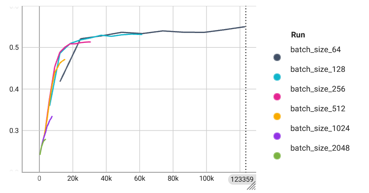
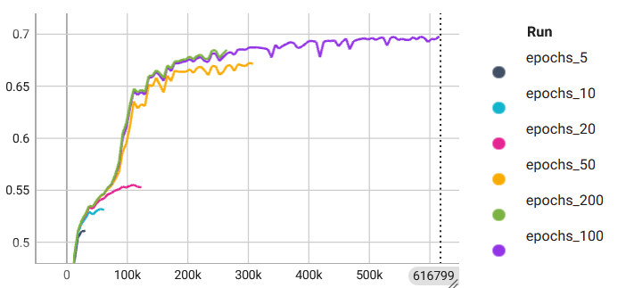
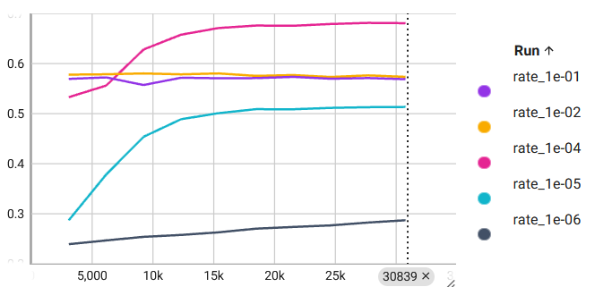

# Advanced Deep Learning Systems: Practical 1

*Author: Basheq Tarifi*

  

This practical consists of two labs, the processes and results of which are documented here.

## Lab 1: Introduction to MASE
This involved an initial investigation into the use of MASE and Machop, including the different basic actions such as `train` and `test` as well as the effects of changing parameters used in training. Additionally, network structures (specifically those for the Jet Substructure dataset (JSC)) were looked at.

### Effects of Parameters
The effects of changing the batch size, epochs, and learning rate when training the `jsc-tiny` model was investigated. In order to train the models with multiple parameters, a `bash` script was written as follows:
```bash
#!/usr/bin/env bash
batch_sizes=(64 128 256 512 1024 2048)
for batch_size in "${batch_sizes[@]}"
do
    echo "Training with batch size: $batch_size"
    $MASE/machop/ch train jsc-tiny jsc --max-epochs 10 --batch-size $batch_size --project "lab-1_jsc-tiny_varying-batch-size"
done
echo "Training complete for all batch sizes."
```

This script trains the `jsc-tiny` model on the `jsc` dataset for the specified batch sizes. Similarly, other scripts were written to train the model while varying the number of epochs and the learning rate.

#### Batch Size
> What is the impact of varying batch sizes and why?

The batch refers to the number of samples used in one iteration of training. Figure 1 shows the validation accuracy for different batch sizes with other parameters unchanged.

<figure>
  
  <figcaption><i>Figure 1: Validation accuracy for different batch sizes</i></figcaption>
</figure>

It is observed that increasing the batch size reduces model performance. While having a larger batch size means that each training iteration has a larger set of data to generalise on, it also means that less iterations can be done (since each epoch will be divided into a smaller number of batches). Having a smaller batch size also provides a noisier estimate of the gradient which will allow the optimisation function to get out of local minima and find a lower overall minima.

#### Epochs
> What is the impact of varying maximum epoch number?

An epoch refers to one complete pass through the dataset. Increasing the number of epochs leads to better generalisation, as too few epochs result in underfitting of the data. This is seen in Figure 2.
<figure>
  
  <figcaption><i>Figure 2: Validation accuracy for different maximum epochs</i></figcaption>
</figure>

Increasing the number of epochs also results in slower training. Figure 2 shows that while the best performing model was trained with 100 epochs, 50 epochs produced a similar result and finished in half the time, which may be an acceptable trade-off. The model trained for 200 epochs stopped early due to the default timeout, but it can be seen it followed a similar trend to 200 epochs and would not have improved it much. Therefore, there is a maximal reasonable number of epochs to use where increasing it would lead to overfitting. This can be prevented by early-stopping.

#### Learning rate
> What is happening with a large learning and what is happening with a small learning rate and why? What is the relationship between learning rates and batch sizes?

The learning rate refers to the rate at which gradients are updated during backpropagation in gradient descent. The results of training with different rates from $10^{-6}$ to $10^{-1}$ are shown in Figure 3.

<figure>
  
  <figcaption><i>Figure 3: Validation accuracy for different learning rates</i></figcaption>
</figure>

The learning rate of $10^{-4}$ outperforms the others by far. With the larger learning rates, the training can be unstable and oscillate, leading to missing minima. In contrast, the smaller rates do not converge fast enough to ever find the minima. The learning rate should be tuned to avoid these issues, and other methods can be used such as an adaptive learning rate based on the gradient values or a learning rate schedule which starts off high and progressively gets smaller.

The learning rate can be related to the batch size through the gradient calculation. With a larger batch size, the gradient calculation is a smoother estimate and a larger learning rate can be used. However, a smaller batch size will have a noisy estimate and a large learning rate my result in instability.

#### Conclusion
These three parameters (among others) should be tuned to provide the best learning, but no single parameter will determine how well a model performs.

### Network Implementation
The `jsc-tiny` network has 117 parameters. A larger network, called `jsc-custom`, was designed with roughly 1.3k parameters as follows ([repo link](../../../machop/chop/models/physical/jet_substructure/__init__.py#L93) | [remote link](https://github.com/btarifi10/mase/tree/btarifi/dev/machop/chop/models/physical/jet_substructure/__init__.py#L93)):
```python
class JSC_Custom(nn.Module):
    def __init__(self, info):
        super(JSC_Custom, self).__init__()
        in_features = info.num_features
        num_classes = info.num_classes
        self.seq_blocks = nn.Sequential(
            # 1st LogicNets Layer
            nn.BatchNorm1d(in_features),  # input_quant       # 0
            nn.ReLU(in_features),                             # 1
            nn.Linear(in_features, 32),  # linear             # 2
            nn.BatchNorm1d(32),  # output_quant      # 3
            nn.ReLU(32),                             # 4
            nn.Dropout(0.2),                         # 5
            nn.Linear(32, 16),  # linear             # 2
            nn.BatchNorm1d(16),  # output_quant      # 7
            nn.ReLU(16),                             # 8
            nn.Dropout(0.2),                         # 5
            nn.Linear(16, num_classes),  # linear              # 10
            nn.BatchNorm1d(num_classes),  # output_quant       # 11
            nn.ReLU(num_classes),                              # 12
        )

    def forward(self, x):
        return self.seq_blocks(x)
```

This network was trained as follows:
```
$ che train jsc-custom jsc --max-epochs 20 --batch-size 128 --learning-rate 0.0001
```

The trained network had a final validation accuracy of 0.7202 and a test accuracy of 0.7194, indicating that it generalises well and is not overfitting the data. For higher results, the number of epochs could be increased.

## Lab 2: Mase Graphs and Passes
This lab involved a deeper dive into MASE and its structures, and how passes are used to both analyse and transform the network.

### Analysis and Transform Passes
The passes are done after converting the model into a `MaseGraph` which wraps the `torch_fx` graph to provide a computational graph consisting of nodes.

As per the lab and provided Colab notebooks, some analysis passes were performed (on the `jsc-tiny` and `jsc-custom` models trained in Lab 1).

#### Analysis Passes
These passes provide structural and statistical information on the models, which can be useful to understand them without diving into the code.

> Explain the functionality of `report_graph_analysis_pass` and its printed jargons such as `placeholder`, `get_attr` 

`report_graph_analysis_pass` steps through each node of the FX graph and counts how many of each node fit the following types:
- `placeholder`- method inputs
- `get_attr`, `call_function`, `call_method`, `call_module` - the operations within the node, whether or not the node is getting an attribute or calling one of a free function, a method or a module
- `output` - how many outputs of the graph

These terms are largely inherited from the PyTorch `torch_fx` structures. The pass also reports the layers in the graph along with their settings (example, `Linear(in_features=16, out_features=5, bias=True)`).

This pass seems like it would be useful for getting an understanding of how the model is structured.

> What are the functionalities of `profile_statistics_analysis_pass` and `report_node_meta_param_analysis_pass` respectively?

`profile_statistics_analysis_pass` iterates through each node and checks whether it matches the arguments specified, and if it does then it computes statistics based on the dummy data passed in. Stats can be computed for weight nodes (where only `call_module` nodes are considered) and for activation nodes separately, and they can also be further filtered by a type of node (example `linear` or `relu`) or specifically by the name. Statistics such as the variance, the range, etc. can be computed.

`report_node_meta_param_analysis_pass` then iterates through the updated graph (processed by `profile_statistics_analysis_pass`) and outputs the stats computed.

#### Transformation Passes

While the analysis passes do not modify the graph, the transformation passes do by embedding and changing parameters. The quantisation pass was done on the network. Quantisation refers to the reduction in precision for the data in the model, for example going from float64 to float32 or int8. This is useful because it can significantly reduce model size and computational time, which will allow the model to work in low-compute contexts such as edge devices. However, it can come at the cost of model performance.

> Explain why only 1 OP is changed after the quantize_transform_pass.

The results of quantization using a configuration which quantized by _type_ of layer on `jsc-tiny` were as follows:

| Original type   | OP           |   Total |   Changed |   Unchanged |
|-----------------|--------------|---------|-----------|-------------|
| BatchNorm1d     | batch_norm1d |       1 |         0 |           1 |
| Linear          | linear       |       1 |         1 |           0 |
| ReLU            | relu         |       2 |         0 |           2 |
| output          | output       |       1 |         0 |           1 |
| x               | placeholder  |       1 |         0 |           1 |

The configuration specifically targeted layers by `type` and only specified a quantization for layers of `linear` type. Since there is only a single linear layer in the network, it was the only layer changed.

> Write some code to traverse both `mg` and `ori_mg`, check and comment on the nodes in these two graphs.

The following basic code was written to traverse the nodes of `mg` and `ori_mg` and compare the nodes:
```python
for og_node, node in zip(ori_mg.fx_graph.nodes, mg.fx_graph.nodes):
    print("----------------------------------------------")
    print(f"original {og_node.name}: {get_node_actual_target(og_node)}")
    print(f"transformed {node.name}: {get_node_actual_target(node)}")
print("----------------------------------------------")
```

This code produced the following output:
```text
----------------------------------------------
original x: x
transformed x: x
----------------------------------------------
original seq_blocks_0: BatchNorm1d(16, eps=1e-05, momentum=0.1, affine=True, track_running_stats=True)
transformed seq_blocks_0: BatchNorm1d(16, eps=1e-05, momentum=0.1, affine=True, track_running_stats=True)
----------------------------------------------
original seq_blocks_1: ReLU(inplace=True)
transformed seq_blocks_1: ReLU(inplace=True)
----------------------------------------------
original seq_blocks_2: Linear(in_features=16, out_features=5, bias=True)
transformed seq_blocks_2: LinearInteger(in_features=16, out_features=5, bias=True)
----------------------------------------------
original seq_blocks_3: ReLU(inplace=True)
transformed seq_blocks_3: ReLU(inplace=True)
----------------------------------------------
original output: output
transformed output: output
----------------------------------------------
```

We can see that all the layers are identical except for `seq_blocks_2`, with the original being of type `Linear` and the new being `LinearInteger` after the quantization pass. The nodes' MASE metadata (accessed via `node.meta['mase]`) can also be looked at for more detailed information. This confirms the observations in the answer above.

> Perform the same quantisation flow to the bigger JSC network that you have trained in lab1. You must be aware that now the `pass_args` for your custom network might be different if you have used more than the `Linear` layer in your network.

The quantisation pass was performed with the following pass arguments, targeting both `linear` and `relu` layers.
```python
pass_args = {
    "by": "type",
    "default": {"config": {"name": None}},
    "linear": {
        "config": {
            "name": "integer",
            # data
            "data_in_width": 2,
            "data_in_frac_width": 2,
            # weight
            "weight_width": 2,
            "weight_frac_width": 2,
            # bias
            "bias_width": 2,
            "bias_frac_width": 2,
        }
    },
    "relu": {
        "config": {
            "name": "integer",
            # data
            "data_in_width": 8,
            "data_in_frac_width": 4,
        }
    },
}
```

The pass is then done as follows:
```python
# ... model loaded from trained checkpoint
mg = MaseGraph(model=model)
mg, _ = init_metadata_analysis_pass(mg, None)
mg, _ = add_common_metadata_analysis_pass(mg, {"dummy_in": dummy_in})
mg, _ = quantize_transform_pass(mg, pass_args)
```

The `summarize_quantization_analysis_pass` produced the following output, as expected:
| Original type   | OP           |   Total |   Changed |   Unchanged |
|-----------------|--------------|---------|-----------|-------------|
| BatchNorm1d     | batch_norm1d |       4 |         0 |           4 |
| Dropout         | dropout      |       2 |         0 |           2 |
| Linear          | linear       |       3 |         3 |           0 |
| ReLU            | relu         |       4 |         4 |           0 |
| output          | output       |       1 |         0 |           1 |
| x               | placeholder  |       1 |         0 |           1 |

> Write code to show and verify that the weights of these layers are indeed quantised.

Some basic code was written to verify the weights were changed by iterating through the original graph and the quantised graph, and logging the weights. An example of the output is shown:
```
Original weights:  tensor([[ 0.0146,  0.0996, -0.0316,  0.0403,  0.0685,  0.1840, -0.0285,  0.0622,
         -0.0455,  0.0711,  0.0172,  0.0250, -0.1422, -0.1315, -0.5085, -0.0726],
        [ 0.0727,  0.1423, -0.3114, -0.0457,  0.0154,  0.1282, -0.0300,  0.0711,
         -0.0192,  0.0455,  0.2072, -0.1718, -0.0718, -0.0205, -0.0191,  0.3600]],
       grad_fn=<SliceBackward0>)
Quantised weights:  tensor([[ 0.0000,  0.0000, -0.0000,  0.0000,  0.0000,  0.2500, -0.0000,  0.0000,
         -0.0000,  0.0000,  0.0000,  0.0000, -0.2500, -0.2500, -0.5000, -0.0000],
        [ 0.0000,  0.2500, -0.2500, -0.0000,  0.0000,  0.2500, -0.0000,  0.0000,
         -0.0000,  0.0000,  0.2500, -0.2500, -0.0000, -0.0000, -0.0000,  0.2500]],
       grad_fn=<SliceBackward0>)
```
It is important to note that the quantised weights are not stored in the MASE metadata, [they are computed in the forward/backward passes](../../../machop/chop/passes/graph/transforms/quantize/quantized_modules/linear.py#L63) ([remote link](https://github.com/btarifi10/mase/tree/btarifi/dev/machop/chop/passes/graph/transforms/quantize/quantized_modules/linear.py#L63)). As such, when printing the above weights the quantiser needed to be called (`module.w_quantizer(module.weight)`).

### Transforms on the command line
Like the other `train` and `test` actions, the `transform` can be done on the command line as follows:
```
./ch transform --config <path/to/toml/file>
```

For the quantisation pass on `jsc-custom`, the toml file is as follows:
```toml
# Basic parameters to do with the model and config
model = "jsc-custom"
dataset = "jsc"
task = "cls"
accelerator = "cpu"
project = "lab-2_transform"
seed = 42
log_every_n_steps = 5
load_name = "./mase_output/lab-1_jsc-custom/software/training_ckpts/best.ckpt"
load_type = "pl"

# General training params, not for the transform
max_epochs = 50 
batch_size = 256
learning_rate = 1e-3

# Transform params
[passes.quantize]
by = "type"
[passes.quantize.default.config]
name = "NA"
[passes.quantize.linear.config]
name = "integer"
"data_in_width" = 8
"data_in_frac_width" = 4
"weight_width" = 8
"weight_frac_width" = 4
"bias_width" = 8
"bias_frac_width" = 4
```

### Counting the number of FLOPs and BitOPs
The number of floating point operations (FLOPs) is a metric used to evaluate a models computational performance and efficiency. Higher FLOPs indicate a more computationally intensive model which may not be desired in some contexts. BitOPs refers to the total number of bitwise operations which will be performed. This is important in the context of quantised networks as this metric can differentiate between the different quantisation schemes.

A pass was written to calculate the total number of FLOPs and BitOPs in the network. The FLOPs were calculated using existing functions in the MASE codebase, such as in [calc_modules.py](https://github.com/DeepWok/mase/tree/main/machop/chop/passes/graph/analysis/flop_estimator/calculator/calc_modules.py). However, this function itself cannot be run due to bugs in the `flop_estimator` module (see [linked issue](https://github.com/DeepWok/mase/issues/54)). The function was therefore copied into a separate module to be used ([link](../../../machop/chop/passes/graph/analysis/flops/calculate_flops.py) | [remote link](https://github.com/btarifi10/mase/tree/btarifi/dev/machop/chop/passes/graph/analysis/flops/calculate_flops.py)).

The number of forward FLOPs is calculated on a module-by-module basis, based on the mathematics and layer sizes, etc. The number of backward FLOPs is different as gradients are calculated, but is commonly taken to be twice the number of forward FLOPs [[1](lab2_bkt123.md#references)].

The number of BitOPs is linked to the number of FLOPs as for each computation, there are BitOPs. The number of BitOPs for each layer is calculated by taking the parameter's bit-width (via its precision, after the quantisation pass) and multiplying it by the number of computations in that layer [[2](lab2_bkt123.md#references)]. For example, for the linear layer the number of BitOPs is `FLOPs * input_bitwidth * weight_bitwidth`.

The pass is implemented as [`analyse_flops_pass()`](../../../machop/chop/passes/graph/analysis/flops/flops_pass.py) ([remote link](https://github.com/btarifi10/mase/tree/btarifi/dev/machop/chop/passes/graph/analysis/flops/flops_pass.py)):
```python
mg, _ = analyse_flops_pass(mg)
```
It produces a table with a summary (the below output is for the larger `jsc-custom` network):

Computations summary:
---------------------
| Node name     | Node type    |   Parameters |   Forward FLOPS |   Backward FLOPS |   Forward bitops |   Backward bitops |
|---------------|--------------|--------------|-----------------|------------------|------------------|-------------------|
| x             | placeholder  |              |                 |                  |                  |                   |
| seq_blocks_0  | batch_norm1d |           32 |             512 |              512 | 524288           |  524288           |
| seq_blocks_1  | relu         |            0 |             128 |              128 |   4096           |    4096           |
| seq_blocks_2  | linear       |          512 |            4096 |             8192 |      4.1943e+06  |       8.38861e+06 |
| seq_blocks_3  | batch_norm1d |           64 |            1024 |             1024 |      1.04858e+06 |       1.04858e+06 |
| seq_blocks_4  | relu         |            0 |             256 |              256 |   8192           |    8192           |
| seq_blocks_5  | dropout      |            0 |               0 |                0 |      0           |       0           |
| seq_blocks_6  | linear       |          512 |            4096 |             8192 |      4.1943e+06  |       8.38861e+06 |
| seq_blocks_7  | batch_norm1d |           32 |             512 |              512 | 524288           |  524288           |
| seq_blocks_8  | relu         |            0 |             128 |              128 |   4096           |    4096           |
| seq_blocks_9  | dropout      |            0 |               0 |                0 |      0           |       0           |
| seq_blocks_10 | linear       |           80 |             640 |             1280 | 655360           |       1.31072e+06 |
| seq_blocks_11 | batch_norm1d |           10 |             160 |              160 | 163840           |  163840           |
| seq_blocks_12 | relu         |            0 |              40 |               40 |   1280           |    1280           |
| output        | output       |              |                 |                  |                  |                   |

## Conclusion
In these two labs, investigations into using MASE for defining, training, testing networks were done. When training, parameters should be tuned to provide the best learning, but no single parameter will determine how well a model performs. MASE can be used within Python via the `chop` module, or directly through the CLI that it provides. Next, analysis and transformations were done on the networks using passes. These passes can either provide structural and statistical information on the network, or transform its layers. An example of the latter is quantisation. A pass to compute the number of FLOPs and BitOPs was written and integrated into MASE.

## References
**[1]** DeepSpeed. _Flops Profiler_. [online] Available at: https://www.deepspeed.ai/tutorials/flops-profiler/#flops-measurement [Accessed 10-02-2024].

**[2]** Yang, L. and Jin, Q., 2021, May. Fracbits: Mixed precision quantization via fractional bit-widths. In _Proceedings of the AAAI Conference on Artificial Intelligence_ (Vol. 35, No. 12, pp. 10612-10620). doi: [10.48550/arXiv.2007.02017](https://doi.org/10.48550/arXiv.2007.02017).

